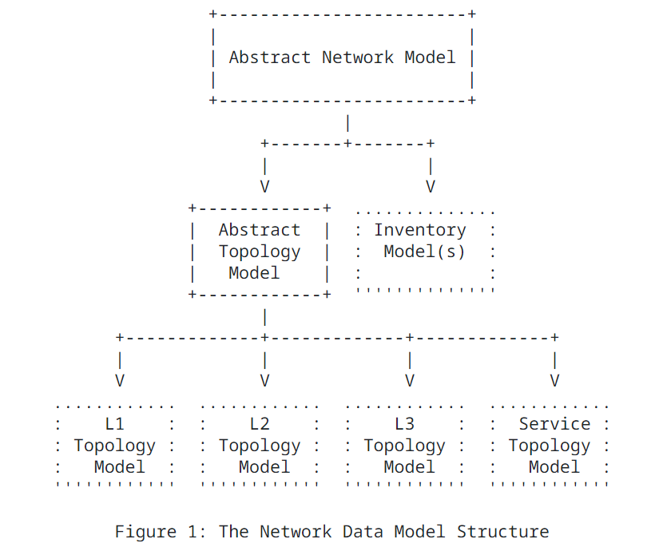

# Digital Map
## Digital Map Introduction

Below is a snippet from [RFC8345](https://datatracker.ietf.org/doc/rfc8345/). It shows the core modules and sample of other augmentations.  
The abstract network node can be augmented in inventory and
topology data models with inventory-specific and topology-specific
attributes.  The network hierarchy (stack) allows any given network
to have one or more "supporting networks".  The relationship between
the base network data model, the inventory data models, and the
topology data models is shown in Figure 1


As we see [here](https://www.yangcatalog.org/yang-search/impact_analysis/ietf-network-topology@2018-02-26) there are ~76
rfc8345 augmentations. Each to model a certain layer/use-case.


##  Goal of this REPO
Our intention here is to share to community how to use [RFC8345](https://datatracker.ietf.org/doc/rfc8345/) and some of
its augmentations to model multi-layers in a real network.

In simple terms to model layers as networks , nodes, links and termination points. And to connect layers together
using the supporting relationships.

## DEMO
In the demo we aim to:
1. Map yang based topology modules to json ones.
2. Map device level yang data to topology data.
3. Create nodes in each layer with their respective termination points.
4. In each layer, add links between termination points.
5. Add support relationships between layers.
6. Provide an example northbound API to execute queries.


In this demo, we focus on the below three layers.
1. ietf-l2-topology using [rfc8944](https://datatracker.ietf.org/doc/rfc8944/)
2. ietf-l3-unicast-topology [rfc8346](https://datatracker.ietf.org/doc/html/rfc8346)
3. ietf-l3-isis-topology [draft-ogondio-nmop-isis-topology](https://datatracker.ietf.org/doc/html/draft-ogondio-nmop-isis-topology-00)


## Requirement
We store the result relations in [neo4j](https://neo4j.com/). You can follow below instructions to install neo4j docker.

### neo4j docker install
```
docker run \
--publish=7474:7474 --publish=7687:7687 \
--volume=/tmp/neo4j_dir:/data \
neo4j:5.20.0
```

### Lab setup
User has two options for the config collection phase.
1. First by running config collection from network devices. In this case direct reachability is needed with netconf enabled on devices.
2. Provide copy of the routers configurations.

Under demos folder add your new folder demo name (in our example here it's "poc-simulated-demo")

### digital_map_db.json
- update with the neo4j ip and credentials

#### netconf_devices.json
- Under the new demo folder, add netconf_devices which is a list of each device with vendor, device type, software version, IP address, port, username and password, device handler [supported handlers](https://github.com/ncclient/ncclient).

#### netconf_scenarios.json
In this section, we define what need to be collected from devices in order to complete the topology mapping for each layer.
- scenarios
    - netconf_scenarios_configured specifies the netconf scenarios we want to run.
    - It should always contain get_running_config for retrieving running configuration.
    - server_capabilities retrieves the server capabilities
    - get_yang_modules_summary retrieves the summary list what yang modules are supported by the device
    - get_yang_modules retrieves all yang modules from the device
    - get_yang_modules_and_submodules retries all yang modules and submodules from the device
    - get_any_path retries the specific path defined with get_any_namespace, get_any_filter and get_any_file
    - get_path_list retries the list of xpaths defined in entity_type_configured (list of entities) and xpath_configured (namespace and xpath)

#### digital_map_scenarios.json
- generate_flat_entity_types: Generates the concrete subservice types from parent abstract subservices (IETFLink, IETFNetwork, IETFNode and IETFTerminationPoint) and inheriting subservices.
- generate_dm_entities: Generates Digital Map entities or what we call subservices and stores to csv files. It retrieves the output of the generate_device_entities and generate_intent_entities and applies mapping to generate the Digital map entities.
- generate_dm_aggregated_entities: Generates Digital Map aggregated entities or what we can aggregated subservices and stores in csv files. These are network wide subservices that are not per device, like links, vpns, tunnels, etc. It retrieves the output of the generate_dm_entities and applies aggregation rules from data/knowledge/aggregation to generate the Digital map aggregated entities.
- generate_dm_relations: Generates Digital Map relations and stores in csv files.  It retrieves the output of the generate_dm_entities and generate_dm_aggregated_entities and applies relations rules from data/knowledge/relations to generate the Digital map relations.
- generate_db_entities: Stores Digital Map entities from csv files (generated by generate_dm_entities and generate_aggregated_entities) to the Digital Map DB. It compares the content of files and current DB and only adds/modifies/removes for changes
- generate_db_relations: Stores Digital Map relations from csv files (generated by generate_dm_relations) to the Digital Map DB. It compares the content of files and current DB and only adds/removes for changes.
### data/entities
This part is used to add external entity instances at any layer. In our lab demo we added a new network called
"Network:Demo LAB" in Network.json
```
{
    "Network":{
        "network-id":"Network:Demo LAB"
    }
}
```

### entities_inheritance
In this section, we have the topology models at each layer mapped to json. Each layer is added with its properties
and whether it has other parent model.

### entities_inheritance/IETF/ietf-network*
Here we define the base entities which are:
- `ietf-network/network`
- `ietf-network/node`
- `ietf-network-topology/link`
- `ietf-network-topology/termination-point`

These are the base models which will then be extended as shown in next sections.
Below is a snippet of `network` based on [RFC8345](https://datatracker.ietf.org/doc/rfc8345/).
The takeaway from this part is the importance of defining the `key`. `key` is used to uniquely
identify each network object in this example.
```
{
  "network": {
    "isAbstract":"yes",
    "key": ["network-id"],
    "properties":{
      "network-id":{
        "Description":"RFC8345 network-id: Identifies a network",
        "Type":""
      },
      "network-types":{
        "Description":"RFC8345 network-types. RFC8944 defines l2-topology for L2",
        "Type":""
      },
      "supporting-network": {
        "Description":"RFC8345 supporting network-id",
        "Type":"list"
      }
    }
  }
}
```
Defines the intermediate level abstract technologies at each layer which extends the
[top base entities](#entitiesinheritanceietfietf-network) and also
can be extended as we'll see in next point. Below is a snippet of
`IETF/ietf-l2-topology/l2-topology-network` where you can see it's based on `container:l2-topology-attributes`
in [rfc8944](https://datatracker.ietf.org/doc/rfc8944/). Since we are define the
"l2-topology-network" we only look at the attributes under augmentation of
"/nw:networks/nw:network".
```
{
  "l2-topology-network": {
    "isAbstract":"yes",
    "parent":"network",
    "properties":{
      "l2-topology-attributes.name":{
        "Description":"Based on RFC8944 name: Name of the topology",
        "Type":""
      },
      "l2-topology-attributes.flags":{
        "Description":"Based on RFC8944 flags: Topology Flags",
        "Type":""
      }
    }
  }
}
```
### entities_inheritance/l2-topology/ethernet
This section is used to allow the user to extend the above abstract definitions with more metadata if needed.
Below is a snippet of `l2-topology/dm-l2-network` where we extend `IETF/ietf-l2-topology/l2-topology-network` with
`label`.
It's worth to note that file name will be mapped at the end to the entity name. I,e l2 created entities at the end
will be named in our case `dm-l2-network` and so on.
```
{
    "dm-l2-network":{
        "layer":"l2-topology",
        "sublayer":"ethernet",
        "parent": "l2-topology-network",
        "properties": {
            "label": {
                "Description": "User friendly short label",
                "Type": ""
            }
        }
    }
}
```
### entities_inheritance/Protocol/ISIS

If we take a snippet from `entities_inheritance/IETF/ietf-l3-isis-topology/isis-topology-node.json` you'll see
it's derived from [draft-ogondio-nmop-isis-topology](https://datatracker.ietf.org/doc/html/draft-ogondio-nmop-isis-topology-00)
```
{
  "isis-topology-node": {
    "isAbstract": "yes",
    "parent":"l3-unicast-topology-node",
    "properties": {
      "isis-node-attributes.system-id": {
        "Description": "System-id of the node.",
        "Type": ""
      },
      "isis-node-attributes.level": {
          "Description": "Level of an IS-IS node - can be level-1,level-2 or level-all.",
          "Type": ""
      },
      "isis-node-attributes.area-address": {
        "Description": "List of areas supported by the protocol instance",
        "Type": "list"
    }
  }
}
```
### data/knowledge
#### mapping
Here we generate the Digital map entities, each json file represent the entity type. Below is an example for generating "ISISArea".
Input_External_Files is amended to use device level extracted files (running-config, ietf-isis, etc)
Input_Internal_Files is amended if any of the previous entity files are needed to generate ISISArea entity.
Python_File is the one that has the mapping logic which basically takes internal/external files as input arguments, then
runs user defined logic to generate  ISISAreas. For example, to generate `network-id`, `network-types`, `area-address`
and `supporting-network-id`.

```
{
  "ISISArea": {
    "Build_Mode": "netconf",
    "Build_Method": "python",
    "Input_External_Files": "openconfig-network-instance.json",
    "Input_Internal_Files": "Network.json",
    "Python_File": "ISISArea.py"
  }
}
```
Since this mapping might be different per vendor, OS, it's determined by the vendor + product + software version
defined in the config for different controller types. For example: knowledge/mapping/cisco/ASR9K-X6/IOSXR781

#### relations
This a crucial config where relations rules are defined. Relation rules defines the relation between:
- entities in the same layer (ex: ISISArea <> ISISProcess)
- entities between layer or as we say `supporting` (ex: ISISArea <> Network)

Below is a snippet of adding a relation between ISISArea & ISISProcess. Here it's important that
we define the link between left entity primary key and right entity foreign key. In below example
rule is `ISISArea.supporting-network-id Equal Network.network-id` and relation type is `supporting`.
```
    {
        "src_entity": "ISISArea",
        "src_entity_attr": "supporting-network-id",
        "dst_entity": "Network",
        "dst_entity_attr": "network-id",
        "correlation_logic": "Equal",
        "type": "supporting",
        "properties": "",
        "show_name": "Supporting network for ISIS Area",
        "description": "RFC8345 supporting-network , network-ref"
    }
```
Relation logic can be more complex like below example (ISISLink <> dm-l2-link)
```
    {
        "src_entity": "ISISLink",
        "src_entity_attr": "source-ne-node & source.source-tp & dest-ne-node & destination.dest-tp",
        "dst_entity": "dm-l2-link",
        "dst_entity_attr": "source.source-node & source.source-tp & destination.dest-node & destination.dest-tp",
        "correlation_logic": "contained_in",
        "type": "supporting",
        "properties": "",
        "show_name": "Supporting interface for ISIS Interface",
        "description": "RFC8345 supporting-tp, tp-ref"
    }
```
The supported relation logics are `Equal`, `contains`, `contained_in`

## output
When entity generation and relations are completed, output is stored in two places: results folder and neo4j

### results
Here we get a csv file format for all the created entities and their respective relations

### neo4j
The generated entities and their respective relations are also stored in neo4j for more query interaction.

To get all ISIS neighbors, use below neo4j query
```
MATCH (srcne:ISISProcess)-[]-(source:ISISInterface)-[]-(link:ISISLink)-[]-(dest:ISISInterface)-[]-(dstne:ISISProcess) return srcne, source, link, dest, dstne
```


To get all L2 connectives
```
MATCH (srcne:`dm-l2-node`)-[]-(source:`dm-l2-interface`)-[]-(link:`dm-l2-link`)-[]-(dest:`dm-l2-interface`)-[]-(dstne:`dm-l2-node`) return srcne, source, link, dest, dstne
```


ISIS with L2 underlay


## API calls
### Discover Lab
GET `/discover-lab/demos/poc-simulated-demo` will start reading the `netconf_devices` & `netconf_scenarios` to connect
to devices and retrieve the needed configurations. They will be then stored under `generated/netconf` directory.

### Generate DM
GET `/generate-dm/demos/poc-simulated-demo` will run the steps defined in the [digital_map_scenarios](#digitalmapscenariosjson)
section. Will store entities and relations in neo4j if needed as well.

GET `/restconf/v1/data/ietf-network:networks/network` is an IETF like API to retrieve all networks
Example response can be found in results/examples/mock-dm-ISIS-instance.json


